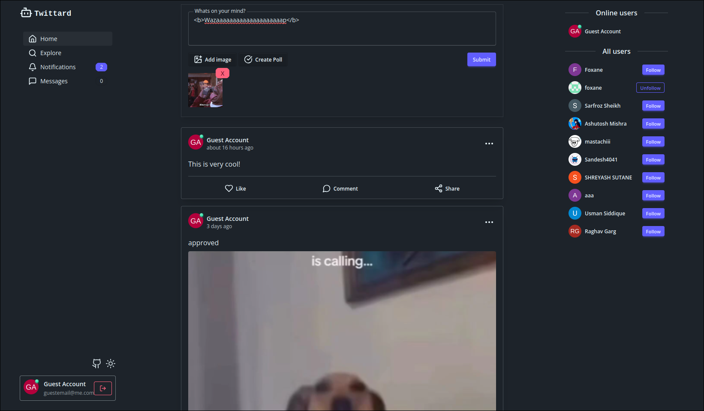
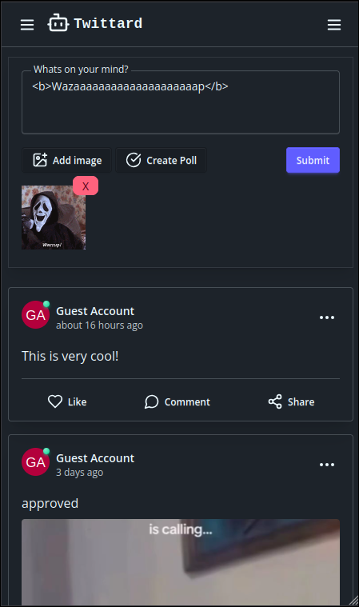
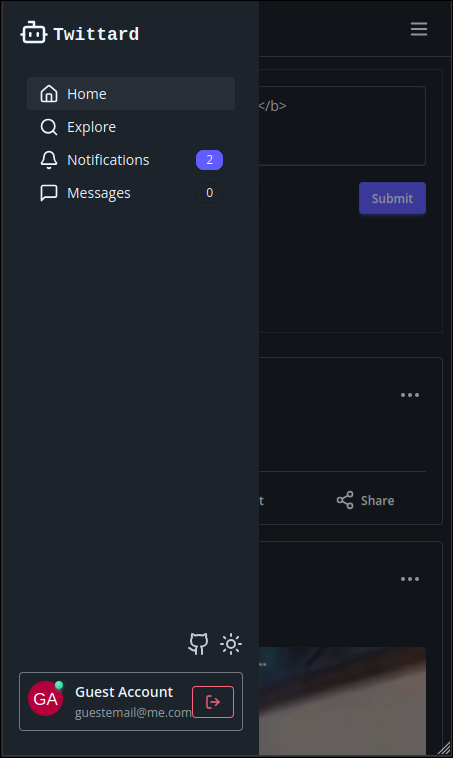
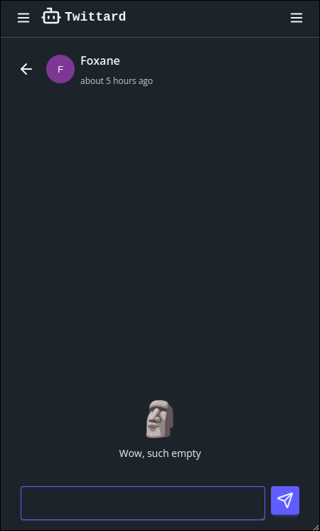

# Twittard

A simple crud react app

## Running locally

- You need backend running, source are here: https://github.com/foxane/odin-book
- Create `.env` and fill it like `.env.example`. Only 2 env var are needed

Using bun, you can simpy do:

- `bun install`
- `bun dev`

For node:

- Remove bun.lock
- Run `npm i --force` or edit `package.json` and change react to v18
- `npm run dev`

## Screenshots

- Desktop home page

  

- Mobile

  
  
  
